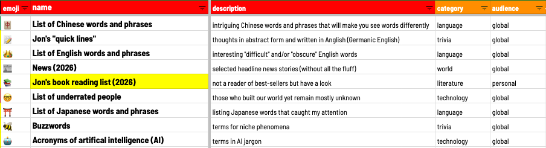
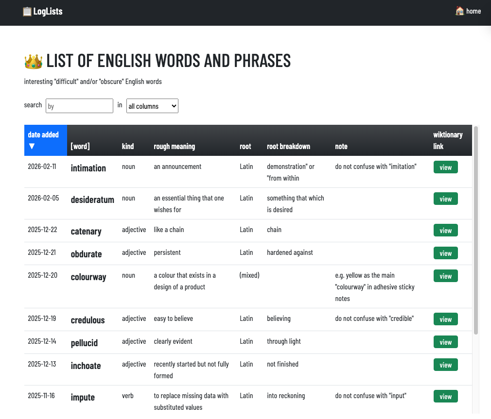
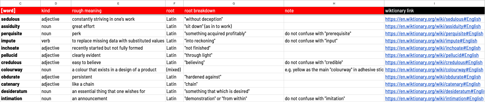

# LogLists

logging rows of truth on spreadsheets for web layouts


a spreadsheet wrapper built with "Alpine.js" that allows "searches" and "sorts", as well as "filters" by field, then shows the rows in a grid on a "website"

## Forewords

I always wanted to use Google Sheets as a back-end (even though some would say it wasn't the best choice), so I made a front-end for it for "information" that did not need that much "security"!

So, it can take a "Google Sheet" like this:



and turn it into this "library":


We can also have a JavaScript array with "objects" ("key-value pairs")

or 

a "Google Sheet" to freshen data quickly in real-time with no "coding"!

## Hallmarks

This web work has:

* a **library** (a "list of lists" which comes from a "workbook")
* a **dataset** (a one-off "list" which comes from a "worksheet")

A sample of a "dataset":



and its spreadsheet equivalent:



## Runtimes

Run the build on either:

<a href="https://loglists.joncoded.com" target="_blank"><button>loglists.joncoded.com</button></a>

or

<a href="https://loglists.vercel.app" target="_blank"><button>loglists.vercel.app</button></a>

## Setup

### `rawData` for quick start-up

in `config.js`:

(1) tweak `rawData` to whatever 

(2) "uncomment" this line out: 

```
const librarySheetURL = ''
```

(3) tweak `appName` if needed

(4) upload to any web "server" (no "build system" needed!)

### Google Sheets for quick "data entry" and tweaking

One-time setup steps:

* start a new [Google sheet](https://sheets.google.com)
* see that the sheet has the first row as headers 
* have at least one google "library" worksheet that shows all the pages, while needing the following columns:   
  * `id` = provides the "unique key" for each row
  * `name` = the title
  * `description` = the content
  * `link` = the hashtag URL, e.g. index.html#mytable
  * `hidden-sheetURL` = the URL of the Google spreadsheet
* on the Google worksheet, go to _File > Share > Publish to web_ (a "modal" pop-up should appear)
  * instead of _Entire document_, choose the "library" worksheet 
  * then, in the next drop-down, instead of "Web page", select _Tab-separated values (.tsv)_
  * copy the URL below the drop-down menus
* go to the "library" sheet to tweak the library ("list of lists")

in `config.js`:

* let `rawData` be and tweak  `librarySheetURL` to a Google Sheet URL 

After this, no more "coding" - only "crud" from Google Sheets

### CRUD-ing in Google Sheets

So, to make new "datasets", go back to the Google Sheets workbook (or start a new one): 

* start a new worksheet with headers and data rows
* on the Google worksheet, use _File > Share > Publish to web_ (a "modal" pop-up should show up)
  * instead of _Entire document_, select the "library" worksheet 
  * then, in the next drop-down, instead of "Web page", select _Tab-separated values (.tsv)_
  * take the URL below the drop-down menus
  * the `hidden-sheetURL` column should have that URL 

Then, any update on the google sheets will result in a live update of the webpages!

## Thanksgiving

With help from:

* [zulfikarditya](https://medium.com/@zulfikarditya/alpine-js-the-minimalist-javascript-framework-for-modern-web-development-839382997988) 